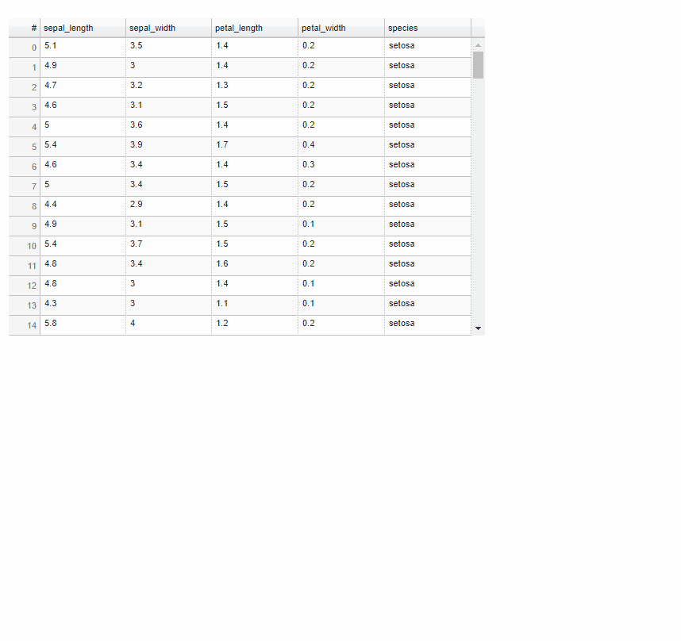
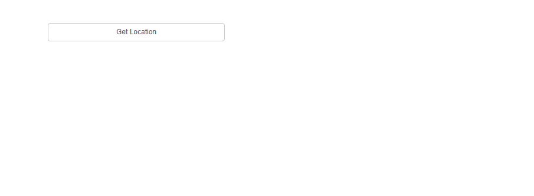

# Background
I really wanted streamlit-bokeh-events to work in my environment(Streamlit 1.18.1 and Bokeh 2.4.3 in windows).<br>
I found out that the plot was not working well because the npm installed BokehJS was not imported well on the StreamlitBokehEventsComponent.tsx, so I rewrote it and index.html files to install BokehJS via it's CDN.<br>
The above changes are breaking changes, so it is expected that they will not work in limited cases where communication with the CDN is not allowed for security reasons(BokehJS browser cache required).<br>
This issue with BokehJS has been set as a milestone, so it may work the original way in the future.<br>
[ [BUG] installing bokehjs from npm doesn't pull in dependencies #12616 ](https://github.com/bokeh/bokeh/issues/12616)<br>

# Installation
Install node.js (Successful build this with 18.14.2 LTS for Windows)
Execute the following
```
git clone https://github.com/ChemEngFlow/streamlit-bokeh-events
cd ./streamlit-bokeh-events/streamlit-bokeh-events/frontend (Move to same directory as package.json)
npm install
npm run build
cd ../ (Move to same directory as setup.py)
pip install .
```
# Changes from the original and reference
1. Fixing module errors (streamlit_bokeh_events/frontend/package.json)<br>
[‘apache-arrow’ module not found error](https://discuss.streamlit.io/t/apache-arrow-module-not-found-error/21952)<br> 
[Node.js 17.0.1 Gatsby error - "digital envelope routines::unsupported ... ERR_OSSL_EVP_UNSUPPORTED" [duplicate]](https://stackoverflow.com/questions/69665222/node-js-17-0-1-gatsby-error-digital-envelope-routinesunsupported-err-os)

2. Fixing Bokeh import error (streamlit_bokeh_events/frontend/public/index.html)<br>
[[bokehjs] Trying to integrate into a TypeScript project](https://discourse.bokeh.org/t/bokehjs-trying-to-integrate-into-a-typescript-project/5274)

3. Add .env (streamlit_bokeh_events/frontend/.env)<br>
For change from port 3000 to 3001 (Not necessary.)

# The following is original

# NOTE
Due to some personal issues I am unable to maintain the project for quite a while.
I am archiving this project and there wont be further updates in it.
Thanks to those who used the package. 

# Streamlit Bokeh Events
A streamlit component for bi-directional communication with bokeh plots.

#### Its just a workaround till streamlit team releases support for bi-directional communication with plots.

## Demo

#### Plots

---
#### Widgets

#### Data Tables


#### Color Picker


#### Run Any Custom JS


#### Get data from Clipboard


## Installation

```bash
pip install streamlit-bokeh-events
```
## Usage

```python
import streamlit as st
from bokeh.plotting import figure
from bokeh.models import ColumnDataSource, CustomJS

# import function
from streamlit_bokeh_events import streamlit_bokeh_events

# create plot
p = figure(tools="lasso_select")
cds = ColumnDataSource(
    data={
        "x": [1, 2, 3, 4],
        "y": [4, 5, 6, 7],
    }
)
p.circle("x", "y", source=cds)

# define events
cds.selected.js_on_change(
    "indices",
    CustomJS(
        args=dict(source=cds),
        code="""
        document.dispatchEvent(
            new CustomEvent("YOUR_EVENT_NAME", {detail: {your_data: "goes-here"}})
        )
        """
    )
)

# result will be a dict of {event_name: event.detail}
# events by default is "", in case of more than one events pass it as a comma separated values
# event1,event2 
# debounce is in ms
# refresh_on_update should be set to False only if we dont want to update datasource at runtime
# override_height overrides the viewport height
result = streamlit_bokeh_events(
        bokeh_plot=p,
        events="YOUR_EVENT_NAME",
        key="foo",
        refresh_on_update=False,
        override_height=600,
        debounce_time=500)

# use the result
st.write(result)
```
